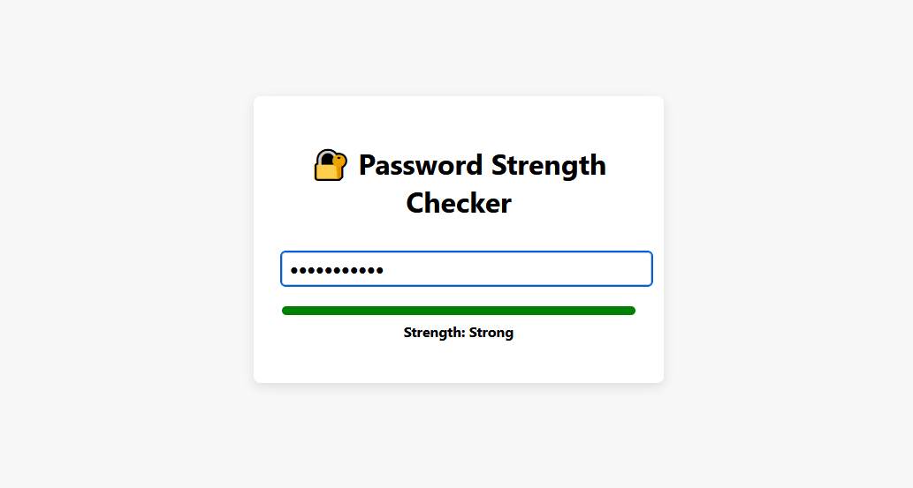

# 🔐 Password Strength Checker

A simple, responsive password strength checker built with HTML, CSS, and vanilla JavaScript. It provides real-time feedback as users type, helping them create stronger and more secure passwords.

---

## 📸 Demo



---

## 🚀 Features

- 🔍 **Live strength analysis** as the user types  
- 📊 **Color-coded progress bar** (Weak, Moderate, Strong)  
- 🔒 Detects uppercase, lowercase, numbers, symbols, and length  
- ✅ Clean, responsive UI  
- 💾 No libraries or frameworks required  

---

## 🛠 Technologies

- **HTML5**  
- **CSS3** (Flexbox, transitions)  
- **JavaScript** (ES6)

---

## 📂 File Structure

- **index.html**  # Main layout
- **style.css**  # Styling
- **script.js**  # Strength evaluation logic

---

## 📝 How to Use

1. **Open the HTML file** in your web browser to see the password strength checker in action.
2. **Type a password** in the input field.
3. **See the strength analysis** as the password is typed.
4. **Adjust the password length** to see how it affects the strength.
5. **Check the color-coded progress bar** to see the strength level.
6. **Enjoy the password strength checker!**

---

## 🚀 Live Demo

[Live Demo](https://your-username.github.io/password-strength-checker/)

---

## 📥 Installation

1. Clone the repository:

   ```bash
   git clone https://github.com/your-username/password-strength-checker.git
   cd password-strength-checker
